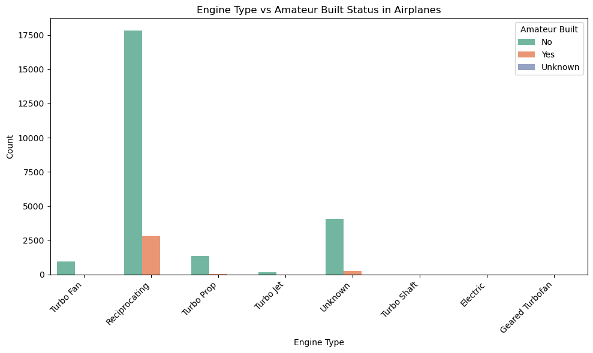

# Aviation Accident Database & Synopses, up to 2023 Data Analysis
## Project Overview
This project analyzes the `Aviation Accident Database & Synopses` `dataset`, which contains records of civil aviation accidents and selected incidents from 1962 to 2023.

The goal is to extract meaningful insights through data cleaning, transformation, and visualization to support business decisions regarding which airplane types to consider for commercial and private use.

By identifying accident trends, evaluating safety records, and understanding the contributing factors to aviation incidents, this analysis aims to guide a new aviation division in selecting the safest and most suitable aircraft models for operation.

## Project Objectives
This project seeks to answer key business questions by:

* Identifying trends in airplane accidents and incidents.

* Highlighting low-risk airplane with the fewest accidents and fatalities.

* Analyzing contributing factors such as weather, mechanical failure or human error.

* Comparing safety records and identifying the best airplanes for commercial and private enterprises.

* Providing actionable recommendations to support airplane purchase decisions.

## Data Understanding
The `dataset` for this analysis is a from `Kaggle` [Aviation Accident Database & Synopses, up to 2023](https://www.kaggle.com/datasets/khsamaha/aviation-accident-database-synopses) which covers civil aviation accidents and selected incidents from 1962 to 2023, in the United States and international waters.

It includes detailed information on:

* Event Accident\Incident date and location

* Severity of injuries and damage

* Weather conditions and flight phase

* Investigation outcomes

The data is stored in an CSV file (`AviationData.csv`) and requires cleaning and preprocessing before analysis

## Business Understanding
The core business question is: 
`Which type of operating airplanes should be purchased for safe and reliable Commercial and Private operations?`
To answer this, the analysis will explore the following sub-questions:

1. What are the specifications of aircrafts and filter airplane in the dataset?
2. How many accidents or incidents has each airplane been involved in and Top 10 safest airplane?
3. What were the causes of the accidents or the incidents and the level of damage sustained on the airplane?
4. Are the said safest airplanes useful for commercial and private operations?

## Data Preparation
### Requirements
* Load and preview the data
    Understand the structure and contents.

* Handle missing values
    Identify and treat nulls appropriately.

* Convert date fields
    Standardize time-related features.

* Aggregate and clean text data
    Normalize categories for consistency and easier analysis.

## The dataset contains 88889 records(rows) and 31 features(columns).
The columns in the dataset contain both string represented as object and decimal numbers as float. That is 5 numerical data and 26 categorical data.
There are several columns with missing values. Records should be `88889` which is not the case for most columns. 
The columns names are partly clean a few needs cleaning. That is;
* They have no special characters
* No white spaces
* Names are descriptive and meaningful
* They contain dots(.) which is fine.
However,
* The title casing should be standardized
* Dates should be converted to Datetime

## Question 1 : What are the specifications of aircrafts and filter airplane in the dataset?
* Most Airplanes have 1 engine.
* Reciprocating engine types are the most common among airplanes.
* Most Airplanes are not Amateur Built

## Question 2: How many accidents or incidents has each airplane been involved in and Top 10 safest airplane?
* Airbus.Industrie A300, Boeing 747-123, Douglas DC-9-51, Mcdonnell.Douglas DC-10-40,Boeing 737-130 are top 5 most safe airplanes with low fatalities but high counts.
* Accidents where the highest causes of fatalities compared to incidents.
* Cessna models have had high counts of fatal accidents over time.

## Question 3 : What were the causes of the accidents or the incidents and the level of damage sustained on the airplane?
* Major causes of accidents and incidents are general, human error and mechanical failure.
* Most airplanes were substantially damaged in the events.
* Unexpectedly most events occurred when the weather was generally good.

## Question 4: Are the said safest airplanes useful for commercial and private operations?
* The data on airplanes purpose were missing, hence the outcome of unknown use high counts.
* `Boeing 747-123` clearly determined by bivariate, multivariate analysis is used for both commercial and personal.

 

# Final Recommendation

Based on the dataset provided and the criteria of low injury severity and minimal damage, the `Boeing 747-123` emerges as the most suitable aircraft for the new aviation division. It is not only identified as safe, but is also positively confirmed to serve both commercial and private operations, making it the ideal candidate for acquisition.

Note: There were significant data gaps in the Purpose of Flight column for many airplane types, with a high proportion of records marked as “Unknown.” This may limit full operational visibility for some aircraft.

Nevertheless, based on their strong safety profiles, defined by high event counts, low fatality rates, and low levels of aircraft damage, the following airplanes are also recommended (despite their purpose being mostly unknown):

`Airbus Industrie A300-600`

`McDonnell Douglas DC-10-40`

`Douglas DC-9-51`

`Boeing 737-130`

These aircraft are ranked among the top five safest based on injury and damage metrics, and merit consideration for future expansion once operational data is clarified.  

  
